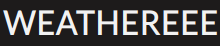

 

  

<h3 align="center">Weathereee</h3>
  

   A weather app that shows the current weather of a location
  

## Table of Contents

- [About The Project](#about-the-project)
  - [Tools Used](#tools-used)
  - [Features](#features)
- [What I Learned](#what-i-learned)
- [Future updates](#future-updates)
- [Live GitHub page](#live-github-page)
- [Credits](#credits)

## About The Project

This app provides the current weather of the location the user is currently in (If allowed location access). It also shows the forecast for 7 hours.
This project was mainly made for learning how to deal with API data. The API that I used is [weatherapi][api]. Currently the API key is public because the key was free and this is just a practice project.

### Tools Used

- HTML5
- Javascript
- CSS
- NPM
- Webpack
- [weatherapi][api]
- [date-fns][date-fns-url]

### Features

- Displays current weather of the specified location
- If allowed shows the weather of the current location of the user
- Shows hourly forecast of 7 hours (3 hours ago, 3 hours after and the current local time of the location)
- Allows user to change between _Metric_ units (Celsisus, Km, etc.) and _Imperial_ units (Fahrenheit, Miles, etc.)

(<a href="#top">back to top</a>)

## What I Learned

This project was relatively easy and short but I learned a lot during this time:

- **Using different Web APIs:** I learned more about the fascinating features that most browsers proide as I used the **Geolocation** and **Fetch** APIs.

- **Handling and processing raw JSON data:** As the data provided by the [weatherapi][api] was too big for my case, I had to process the data which was a new learning experience.

- **Asynchronous Javascript:** It was through this project that I got introduced to the world of async Javascript as I had to make different API calls.

- **Promises:** Dealing with async JS would be pretty hard if I only used callbacks. Promises are what saved me from **callback hell**, and I learnt how powerful they are and how to use them. (Also **async** and **await**)

- **Designing:** As the weather API provided tons of data I had to think a lot about designing the front-end in a way that gives compact and useful information to the user without cluttering their screen and confusing them, so I had to apply different techniques like: cards, flip cards and confition icons which improved my designing capabilities.

(<a href="#top">back to top</a>)

## Future updates

- **Add weekly forecast:** Currently the API sends me the forecast data for 3 days but I have only used the current weather data so all I need to do is make the front-end for the weekly forecast.
- **Responsive:** The app breaks for smaller resolutions so that needs to be fixed
- **Organize CSS:** The current CSS for the app is all random and cluttered which should be organized.
- **Search suggestions:** Currently the user is only notified if the search did not yield anything after searching, a great feature to add would be suggestions while the user types.

(<a href="#top">back to top</a>)

## Live GitHub page

[Hosted live on github pages][gh-page]

(<a href="#top">back to top</a>)

## Credits

- [Data provided by weatherapi][api]
- [All icons by Icons8][Icons8-credit]

(<a href="#top">back to top</a>)

<!-- LINKS -->

[api]: https://www.weatherapi.com/
[date-fns-url]: https://date-fns.org/
[gh-page]: https://imaginepog.github.io/weather-app/
[Icons8-credit]: https://icons8.com
